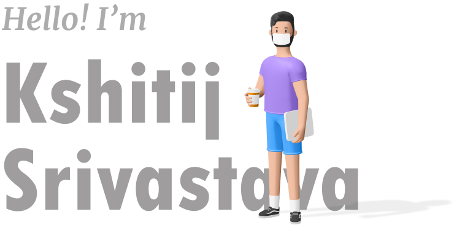

<h1>Hey there! 👋</h1>

   _Hi, I'm **Kshitij Srivastava**, a frontend developer dedicated to crafting seamless digital experiences. With a keen eye for design and a knack for coding, I blend creativity with functionality to build sleek, responsive websites and intuitive web applications_
  
_In my non-coding hours, I enjoy sketching, 3D modeling, gaming, or embarking on cosmic exploration._ 🌌
  
🤝 _Let's connect and collaborate on innovative projects. Feel free to reach out—I'm always excited about new opportunities and challenges!_
 
 

<!-- <h3 align='center'><i>Social Media Handles</i></h3> -->

&nbsp;&nbsp;&nbsp;&nbsp;
&nbsp;&nbsp;&nbsp;&nbsp;

 

<h2 align="center">🧑‍💻<i>Tech Stack </i></h2>
 
<table align="center" width="100%">
<tr>
    <td align='center' height="100">
        
    </td>
    <td align='center' height="100">
        
    </td>
    <td align='center' height="100">
        
    </td>
     <td align='center' height="100">
        
    </td>
    <td align='center'  height="100">
        
    </td>
</tr>
<tr>
    <td align='center' height="100">
            
    </td>
    <td align='center' height="100">
            
    </td>
     <td align='center' height="100">
        
    </td>
    <td align='center' height="100">
        
    </td>
     <td align='center' height="100">
        
    </td>
</tr>
<tr>
    <td align='center' height="100">
        
    </td>
    <td align='center' height="100">
        
    </td>
    <td align='center' height="100">
        
    </td>
    <td align='center' height="100">
        
    </td>
    <td align='center' height="100">
        
    </td>
</tr>
</table>

 

<h2 align="center">📈 <i>Stats</i></h2>

<!--</img>-->

<!-- -->

<!--
**Kshitij978/Kshitij978** is a ✨ _special_ ✨ repository because its `README.md` (this file) appears on your GitHub profile.

Here are some ideas to get you started:

- 🔭 I’m currently working on ...
- 🌱 I’m currently learning ...
- 👯 I’m looking to collaborate on ...
- 🤔 I’m looking for help with ...
- 💬 Ask me about ...
- 📫 How to reach me: ...
- 😄 Pronouns: ...
- ⚡ Fun fact: ...
-->
